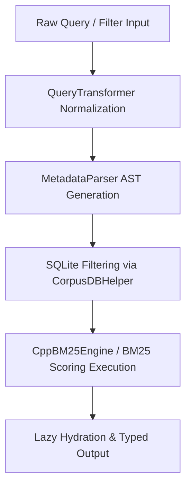

# AuraAI Search Pipeline Architecture

## System Overview
AuraAI uses a decoupled, modular pipeline to execute high-speed sparse document retrievals with C++ acceleration.

## Unidirectional Data Flow
Data flows through the retrieval pipeline strictly in a unidirectional stage structure:

1. **Raw Input:** The user query string and optional metadata filter string.
2. **Normalized Query:** Normalized query string produced by `QueryTransformer`, stripping punctuation/control characters and normalizing casing.
3. **Parsed AST:** Filter conditions parsed by `MetadataParser` into an AST structure (`FilterExpression`, `LogicalExpression`, `NotExpression`).
4. **Engine Execution:** Bitmaps generated from the AST filters restrict the documents processed by the BM25 scorer (with C++ acceleration).
5. **Typed Output:** Score-based list of results enriched with metadata from SQLite via lazy evaluation.

## Configuration & Schema Validation
All settings are configured in `config/config.yaml` and validated at runtime on application startup via Pydantic model definition (`src/config_schema.py`). 

## Error Index Mapping
The following table outlines the system error codes and descriptions:

| Error Code | Component | Description | Fallback Behavior |
| :--- | :--- | :--- | :--- |
| `ERR_CFG_01` | Config | Configuration structure fails schema verification constraints. | Application exits during launcher validation phase. |
| `ERR_PAR_02` | Parser | Metadata filter syntax parsing failure. | Log error and proceed without filter constraints. |
| `ERR_CPP_03` | C++ Engine | C++ shared library `.dll` initialization or scoring failure. | Fallback to python roaring bitmap filtering and `bm25s` score retrieval. |
| `ERR_TMO_04` | Search Exec | Search execution times exceed threshold bounds (>5s). | Stop processing context thread and return empty query list. |
| `ERR_VAL_05` | Manifest | Checksum mismatch or manifest check validation fail. | Log warning message and fallback to automatic rebuild or direct load. |
